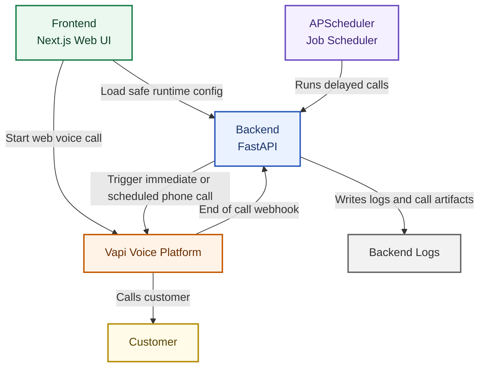

# Riverwood Voice Agent

This is an MVP AI voice calling system for Riverwood Projects.

It lets you:

1. Trigger immediate or scheduled outbound calls from the backend.
2. Start a live browser web call from the frontend.
3. Capture call outcomes through webhook logs.

---

## Architecture

This is the high-level flow used in this project.

### Mermaid Diagram



Simple story:

1. Frontend asks backend for safe call config.
2. Calls can start from frontend web call or backend trigger API.
3. Vapi handles the live voice conversation.
4. Vapi sends final call data back to backend webhook.
5. Backend logs transcript and summary artifacts.

---

## Tech Stack

| Layer | Choice | Why |
|---|---|---|
| Backend | FastAPI on Python 3.12 | Clean async APIs and easy docs |
| Scheduler | APScheduler | Simple delayed-call support for MVP |
| Frontend | Next.js | Thin UI layer for web call demo |
| Voice Platform | Vapi + ElevenLabs + GPT-4o-mini | Good realism and low latency |
| Infra | Docker Compose | Easy local setup and demo |

---

## Project Structure

```
src/
├── main.py              # App factory, lifespan (scheduler + httpx client), CORS
├── core/
│   └── config.py        # pydantic-settings — env vars, fail-fast on boot
├── schemas/
│   └── call_schemas.py  # Pydantic V2 request/response models
├── services/
│   └── vapi_service.py  # Vapi HTTP client — single shared AsyncClient
└── api/
    └── routes.py        # POST /api/calls/trigger, POST /api/webhook/vapi, GET /health
```

---

## Local Setup

Prerequisites: [uv](https://docs.astral.sh/uv/getting-started/installation/) and Docker

### 1. Environment

```bash
cp .env.example .env
```

| Variable | Where to find it |
|---|---|
| `VAPI_PRIVATE_API_KEY` | Vapi dashboard → Account → API Keys |
| `VAPI_ASSISTANT_ID` | Vapi dashboard → Assistants → your assistant |
| `VAPI_PHONE_NUMBER_ID` | Vapi dashboard → Phone Numbers → your number's UUID |
| `VAPI_PUBLIC_API_KEY` (optional) | Vapi dashboard → API Keys → public key (for browser web calls) |

> **Note:** Free Vapi numbers only support US/Canada (`+1`). To call international numbers, import a Twilio number via Vapi dashboard → Phone Numbers → Import.

### 2. Run Backend Locally

```bash
make install   # uv sync — installs deps, creates .venv
make dev       # uvicorn with --reload on :8000
```

### 3. Run With Docker

```bash
make up        # builds image + starts container detached
make logs      # tail container logs
make down      # stop and remove
```

---

## API Endpoints

Interactive docs: http://localhost:8000/docs

### `POST /api/calls/trigger`

Triggers an immediate or scheduled outbound call.

```json
{
  "phone_number": "+919876543210",
  "customer_name": "Arjun Sharma",
  "delay_minutes": null
}
```

| Field | Type | Rules |
|---|---|---|
| `phone_number` | `string` | E.164 format required (`+` prefix) |
| `customer_name` | `string` | Injected into the AI's opening line |
| `delay_minutes` | `int \| null` | `null` = call now · `1–10080` = schedule N minutes out |

**Responses**

```
202 — { "status": "initiated", "call_id": "..." }         immediate call
202 — { "status": "scheduled", "scheduled_at": "..." }    future call
422 — validation error (bad phone format, out-of-range delay)
502 — Vapi API error (wrong credentials, unsupported number)
504 — Vapi request timed out
```

The backend injects a personalized first message using customer_name.

---

### POST /api/webhook/vapi

Point **Server URL** in your Vapi dashboard to `https://<your-domain>/api/webhook/vapi`. Vapi POSTs the end-of-call report here. The handler extracts and logs the transcript and AI-generated summary.

```
200 — { "received": true }
```

---

### GET /api/frontend/call-config

Returns browser-safe runtime configuration for web calls.

```
200 — {
  "web_call_enabled": true | false,
  "assistant_id": "..." | null,
  "public_key": "..." | null
}
```

If `VAPI_PUBLIC_API_KEY` is missing (or still a placeholder), `web_call_enabled` is `false`.

---

### GET /health

```
200 — { "status": "ok" }
```

Used by the Docker healthcheck and any uptime monitor.

---

## Make Commands

```
make install      uv sync (install/update deps)
make dev          local dev server, hot-reload
make build        docker build, layer cache
make build-fresh  docker build, no cache
make up           build + start container
make down         stop + remove container
make logs         tail container logs
```

---

## Cost Estimate (1000 Calls)

Using a dashboard estimate of around $0.11 per minute:

1. 1000 calls x 1.5 min average length = 1500 minutes
2. 1500 x $0.11 = about $165

Estimated runtime voice cost: about $165 per 1000 calls (before extra infra/platform overhead).

---

## Scaling Beyond MVP

This project is intentionally simple for MVP speed. To handle large daily campaigns, evolve it in small steps:

1. Move call requests into a queue so jobs are processed smoothly.
2. Run multiple worker instances to handle higher traffic.
3. Store call outcomes in a database instead of logs only.
4. Add retry rules, rate limiting, and health dashboards.
5. Use multiple phone channels to increase outbound throughput.

In short: keep the same architecture style, but swap in queue + workers + durable storage for scale.
