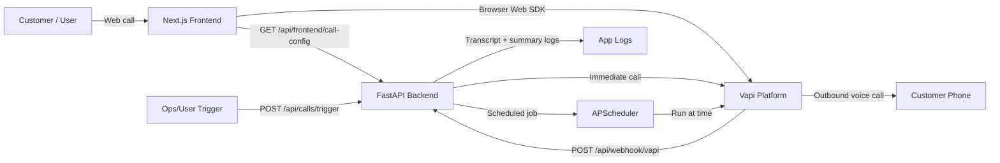

# Riverwood Voice Agent

Outbound AI calling backend for Riverwood Projects. Triggers and schedules personalised voice calls via [Vapi.ai](https://vapi.ai), logs end-of-call transcripts through a webhook, and runs as a single containerised service.

---

## How It Works

```
Your Frontend / curl
        │
        │  POST /api/calls/trigger
        ▼
┌───────────────────────────────┐
│         FastAPI (async)       │
│                               │
│  delay_minutes = null?        │
│  ├─ YES → Vapi API (now)      │
│  └─ NO  → APScheduler ──────┐ │
└───────────────────────────┬──┘ │
                            │    │
                   fires at │    │  POST /call/phone
                   run_date │    ▼
                            │  Vapi.ai
                            │    │
                            │    │  dials
                            │    ▼
                            │  Customer Phone (+91XXXXXXXXXX)
                            │
                   POST /api/webhook/vapi (end-of-call report)
                            │
                            ▼
                     Python logger (transcript + summary)
```

**Request path latency budget:** FastAPI async handler → single shared `httpx.AsyncClient` (no per-request TCP handshake) → Vapi with GPT-4o-mini + ElevenLabs Turbo v2.5 → TTFT ~390ms.

### Mermaid Architecture (For Loom)



---

## Stack

| Layer | Choice | Why |
|---|---|---|
| Runtime | Python 3.12 | Latest stable, pattern matching, native `X \| Y` types |
| Framework | FastAPI | Async-first, auto OpenAPI docs, lifespan hooks |
| HTTP Client | httpx (async) | Shared connection pool, eliminates per-call TCP overhead |
| Scheduler | APScheduler 3.x `AsyncIOScheduler` | In-process, zero infra — right-sized for an MVP |
| Config | pydantic-settings | Fails loudly on missing env vars at startup, not at call time |
| Packaging | uv | 10–100× faster than pip, deterministic lockfile |
| Container | Docker multi-stage | Builder (uv) → slim runtime, no build tools in prod image |
| Voice AI | Vapi + ElevenLabs Turbo v2.5 + GPT-4o-mini | Low-latency outbound calls with dynamic first message |

---

## Project Structure

```
src/
├── main.py              # App factory, lifespan (scheduler + httpx client), CORS
├── core/
│   └── config.py        # pydantic-settings — env vars, fail-fast on boot
├── schemas/
│   └── call_schemas.py  # Pydantic V2 request/response models
├── services/
│   └── vapi_service.py  # Vapi HTTP client — single shared AsyncClient
└── api/
    └── routes.py        # POST /api/calls/trigger, POST /api/webhook/vapi, GET /health
```

---

## Setup

**Prerequisites:** [uv](https://docs.astral.sh/uv/getting-started/installation/), Docker

### 1. Environment

```bash
cp .env.example .env
```

| Variable | Where to find it |
|---|---|
| `VAPI_PRIVATE_API_KEY` | Vapi dashboard → Account → API Keys |
| `VAPI_ASSISTANT_ID` | Vapi dashboard → Assistants → your assistant |
| `VAPI_PHONE_NUMBER_ID` | Vapi dashboard → Phone Numbers → your number's UUID |
| `VAPI_PUBLIC_API_KEY` (optional) | Vapi dashboard → API Keys → public key (for browser web calls) |

> **Note:** Free Vapi numbers only support US/Canada (`+1`). To call international numbers, import a Twilio number via Vapi dashboard → Phone Numbers → Import.

### 2. Run locally

```bash
make install   # uv sync — installs deps, creates .venv
make dev       # uvicorn with --reload on :8000
```

### 3. Run with Docker

```bash
make up        # builds image + starts container detached
make logs      # tail container logs
make down      # stop and remove
```

---

## API

Interactive docs at `http://localhost:8000/docs`

### `POST /api/calls/trigger`

Triggers an immediate or scheduled outbound call.

```json
{
  "phone_number": "+919876543210",
  "customer_name": "Arjun Sharma",
  "delay_minutes": null
}
```

| Field | Type | Rules |
|---|---|---|
| `phone_number` | `string` | E.164 format required (`+` prefix) |
| `customer_name` | `string` | Injected into the AI's opening line |
| `delay_minutes` | `int \| null` | `null` = call now · `1–10080` = schedule N minutes out |

**Responses**

```
202 — { "status": "initiated", "call_id": "..." }         immediate call
202 — { "status": "scheduled", "scheduled_at": "..." }    future call
422 — validation error (bad phone format, out-of-range delay)
502 — Vapi API error (wrong credentials, unsupported number)
504 — Vapi request timed out
```

The AI greets the customer with:
> *"Hi {customer_name}! This is the AI customer success team at Riverwood Projects. Am I speaking with the plot owner?"*

---

### `POST /api/webhook/vapi`

Point **Server URL** in your Vapi dashboard to `https://<your-domain>/api/webhook/vapi`. Vapi POSTs the end-of-call report here. The handler extracts and logs the transcript and AI-generated summary.

```
200 — { "received": true }
```

---

### `GET /api/frontend/call-config`

Returns browser-safe runtime configuration for web calls.

```
200 — {
  "web_call_enabled": true | false,
  "assistant_id": "..." | null,
  "public_key": "..." | null
}
```

If `VAPI_PUBLIC_API_KEY` is missing (or still a placeholder), `web_call_enabled` is `false`.

---

### `GET /health`

```
200 — { "status": "ok" }
```

Used by the Docker healthcheck and any uptime monitor.

---

## Make Targets

```
make install      uv sync (install/update deps)
make dev          local dev server, hot-reload
make build        docker build, layer cache
make build-fresh  docker build, no cache
make up           build + start container
make down         stop + remove container
make logs         tail container logs
```

---

## Loom Script (3-4 Minutes)

Use this exact flow while recording:

1. Intro (20s):
"This is my Riverwood AI Voice Agent MVP for the internship challenge. It handles outbound customer updates with a warm bilingual conversation flow, low latency, and structured call outcomes."

2. Architecture (45s):
Open this README and show the Mermaid diagram.
Explain:
- FastAPI is the backend control layer.
- Next.js is a thin UI layer for web calls.
- Vapi handles voice pipeline and model orchestration.
- Webhook returns end-of-call artifacts for transcript/summary logging.

3. Dashboard settings (45s):
Show your Vapi prompt/settings and explain:
- short 1-2 sentence responses for latency,
- bilingual behavior (English + Hindi),
- no fake follow-up promises unless tools are enabled.

4. Live demo (60-90s):
- Trigger one call flow.
- Show greeting, project update, visit-intent question, and polite call close.
- Show where transcript/summary or call log appears.

5. Scale answer (30s):
"For 1000 daily calls, I would use batched queue-based triggering, horizontal workers, and rate-limited phone-number pools with retry policies and observability metrics."

6. Close (10s):
"This MVP is intentionally simple: strong voice realism, low latency, and structured outputs over overengineering."

---

## Submission Checklist

1. Loom video link recorded and accessible.
2. Demo/code link ready (GitHub repo).
3. Short technical note included (architecture + scale design).
4. Estimated cost per 1000 calls included.

Suggested cost line for submission note:

Given dashboard estimate `~$0.11/min`, projected daily voice cost is:

- 1000 calls × avg 1.5 min ≈ 1500 min/day
- 1500 × $0.11 ≈ `$165/day` voice runtime cost (before infra overhead)

---

## Scaling Beyond MVP

The current design is intentionally minimal — APScheduler in-process, no DB, structured logging instead of a data store. Here's how each constraint lifts as load grows:

| Concern | MVP | At scale (1 000 concurrent calls) |
|---|---|---|
| Scheduler | APScheduler in-memory | Replace with Celery + Redis or AWS SQS worker pool |
| Call state | Python logger | Append-only Postgres table or DynamoDB |
| Horizontal scale | Single container | Auto-scaling ECS/Fargate tasks behind an ALB |
| Concurrency cap | Vapi account limit | Multiple Twilio numbers, round-robin via `phoneNumberId` |
| Observability | `logging` module | OpenTelemetry → Grafana / Datadog |
